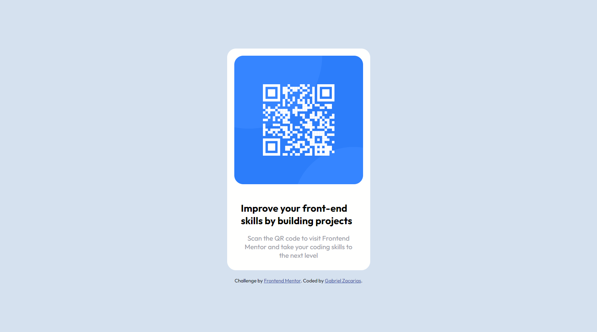

# QR CODE SIMPLES

> Projeto Simples de Aprimoramento de Habilidades em CSS e HTML

Este é um projeto simples desenvolvido com base em um desafio disponível no site https://www.frontendmentor.io/challenges. O objetivo principal é proporcionar um ambiente de prática para aprimorar suas habilidades em CSS e HTML.

> Sobre o Projeto

Neste projeto, você encontrará uma implementação prática dos conceitos de design responsivo, estruturação HTML semântica e estilização detalhada usando CSS. O desafio escolhido do Frontend Mentor serve como uma base sólida para aprimorar suas habilidades técnicas e criativas.

> Objetivos

- Reforçar o entendimento de layouts responsivos.
- Praticar a criação e organização de elementos HTML de forma semântica.
- Explorar técnicas avançadas de estilização com CSS.
- Ganhar confiança na tradução de um design visual para uma interface funcional.

🔗 [Clique aqui para acessar](https://gabrielzacariassoler.github.io/QR-Code-Simples/)

## 🛠️ Tecnologias

- HTML
- CSS

## ❤️ Contato

gabrielzsdev@gmail.com
